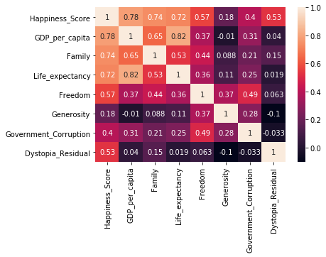
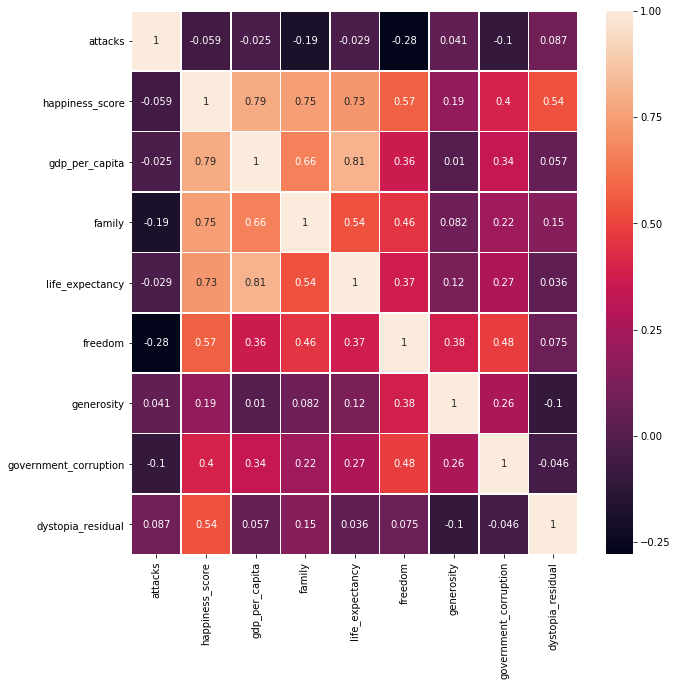

<h1>World happiness report</h1>
Had a look at happiness regarding different factors such as areas
Linked happiness with terrorism and suicides
First approach to Apache Hive


Happiness: https://www.kaggle.com/unsdsn/world-happiness#2017.csv
Suicide case: https://www.kaggle.com/szamil/who-suicide-statistics
Worldwide Terrorism: https://www.kaggle.com/START-UMD/gtd


```python
#pip install pygal_maps_world & conda install -c conda-forge pyhamcrest  & pip install cairosvg & pycountry
import pandas as pd
from pyhive import hive
#Heat map
import seaborn as sns 
#Linear regression
import statsmodels.api as sm

import pygal.maps.world as pymap
import pycountry
```


```python
cursor = hive.connect('localhost').cursor()
cursor.execute('drop database if exists pjHive cascade')
cursor.execute('create database if not exists pjHive')
cursor.execute('use pjHive')
```


```python
# Happiness (3 different tables because we don't have the same datas for each year)
cursor.execute('drop table if exists happiness2015')
cursor.execute("create table if not exists happiness2015 (Country string,Region string,Happiness_Rank int,Happiness_Score float,Standard_Error float,GDP_Per_Capita float,Family float,Life_Expectancy float,Freedom float,Government_Corruption float,Generosity float,Dystopia_Residual float) "\
               +"row format delimited fields terminated by ',' "\
               +"stored as textfile "\
               +"tblproperties('skip.header.line.count'='1')");
cursor.execute("load data local inpath '/home/cloudera/Desktop/pjHive/2015.csv' into table happiness2015")

cursor.execute('drop table if exists happiness2016')
cursor.execute("create table if not exists happiness2016 (Country string,Region string,Happiness_Rank int,Happiness_Score float,Lower_Confidence_Interval float,Upper_Confidence_Interval float,GDP_per_Capita float,Family float,Life_Expectancy float,Freedom float,Government_Corruption float,Generosity float,Dystopia_Residual float) "\
               +"row format delimited fields terminated by ',' "\
               +"stored as textfile "\
               +"tblproperties('skip.header.line.count'='1')");
cursor.execute("load data local inpath '/home/cloudera/Desktop/pjHive/2016.csv' into table happiness2016")

cursor.execute('drop table if exists happiness2017')
cursor.execute("create table if not exists happiness2017 (Country string,Happiness_Rank int ,Happiness_Score float,Whisker_high float,Whisker_low float,GDP_per_Capita float,Family float,Life_Expectancy float,Freedom float,Generosity float,Government_Corruption float,Dystopia_Residual float) "\
               +"row format delimited fields terminated by ',' "\
               +"stored as textfile "\
               +"tblproperties('skip.header.line.count'='1')");
cursor.execute("load data local inpath '/home/cloudera/Desktop/pjHive/2017.csv' into table happiness2017")


#Terrorism
cursor.execute('drop table if exists terrorism')
cursor.execute("create table if not exists terrorism (eventid string,iyear string,imonth string,iday string,approxdate string,extend string,resolution string,country string,country_txt string,region string,region_txt string,provstate string,city string,latitude string,longitude string,specificity string,vicinity string,location string,summary string,crit1 string,crit2 string,crit3 string,doubtterr string,alternative string,alternative_txt string,multiple string,success string,suicide string,attacktype1 string,attacktype1_txt string,attacktype2 string,attacktype2_txt string,attacktype3 string,attacktype3_txt string,targtype1 string,targtype1_txt string,targsubtype1 string,targsubtype1_txt string,corp1 string,target1 string,natlty1 string,natlty1_txt string,targtype2 string,targtype2_txt string,targsubtype2 string,targsubtype2_txt string,corp2 string,target2 string,natlty2 string,natlty2_txt string,targtype3 string,targtype3_txt string,targsubtype3 string,targsubtype3_txt string,corp3 string,target3 string,natlty3 string,natlty3_txt string,gname string,gsubname string,gname2 string,gsubname2 string,gname3 string,gsubname3 string,motive string,guncertain1 string,guncertain2 string,guncertain3 string,individual string,nperps string,nperpcap string,claimed string,claimmode string,claimmode_txt string,claim2 string,claimmode2 string,claimmode2_txt string,claim3 string,claimmode3 string,claimmode3_txt string,compclaim string,weaptype1 string,weaptype1_txt string,weapsubtype1 string,weapsubtype1_txt string,weaptype2 string,weaptype2_txt string,weapsubtype2 string,weapsubtype2_txt string,weaptype3 string,weaptype3_txt string,weapsubtype3 string,weapsubtype3_txt string,weaptype4 string,weaptype4_txt string,weapsubtype4 string,weapsubtype4_txt string,weapdetail string,nkill string,nkillus string,nkillter string,nwound string,nwoundus string,nwoundte string,property string,propextent string,propextent_txt string,propvalue string,propcomment string,ishostkid string,nhostkid string,nhostkidus string,nhours string,ndays string,divert string,kidhijcountry string,ransom string,ransomamt string,ransomamtus string,ransompaid string,ransompaidus string,ransomnote string,hostkidoutcome string,hostkidoutcome_txt string,nreleased string,addnotes string,scite1 string,scite2 string,scite3 string,dbsource string,INT_LOG string,INT_IDEO string,INT_MISC string,INT_ANY string,related string) "\
               +"row format delimited fields terminated by ',' "\
               +"stored as textfile "\
               +"tblproperties('skip.header.line.count'='1')");
cursor.execute("load data local inpath '/home/cloudera/Desktop/pjHive/terrorism.csv' into table terrorism")

```


```python
cursor.execute('select h2015.Country, h2015.Happiness_score, h2016.Happiness_score,h2017.Happiness_score from happiness2015 h2015 join happiness2016 h2016 on h2016.Country = h2015.Country join happiness2017 h2017 on h2017.Country = h2015.Country')
rows = pd.DataFrame(cursor.fetchall(),columns=['country','a', 'b','c'])
rows.head(10)
```


<div>
<style scoped>
    .dataframe tbody tr th:only-of-type {
        vertical-align: middle;
    }

    .dataframe tbody tr th {
        vertical-align: top;
    }

    .dataframe thead th {
        text-align: right;
    }
</style>
<table border="1" class="dataframe">
  <thead>
    <tr style="text-align: right;">
      <th></th>
      <th>country</th>
      <th>a</th>
      <th>b</th>
      <th>c</th>
    </tr>
  </thead>
  <tbody>
    <tr>
      <th>0</th>
      <td>Norway</td>
      <td>7.522</td>
      <td>7.498</td>
      <td>7.537</td>
    </tr>
    <tr>
      <th>1</th>
      <td>Denmark</td>
      <td>7.527</td>
      <td>7.526</td>
      <td>7.522</td>
    </tr>
    <tr>
      <th>2</th>
      <td>Iceland</td>
      <td>7.561</td>
      <td>7.501</td>
      <td>7.504</td>
    </tr>
    <tr>
      <th>3</th>
      <td>Switzerland</td>
      <td>7.587</td>
      <td>7.509</td>
      <td>7.494</td>
    </tr>
    <tr>
      <th>4</th>
      <td>Finland</td>
      <td>7.406</td>
      <td>7.413</td>
      <td>7.469</td>
    </tr>
    <tr>
      <th>5</th>
      <td>Netherlands</td>
      <td>7.378</td>
      <td>7.339</td>
      <td>7.377</td>
    </tr>
    <tr>
      <th>6</th>
      <td>Canada</td>
      <td>7.427</td>
      <td>7.404</td>
      <td>7.316</td>
    </tr>
    <tr>
      <th>7</th>
      <td>New Zealand</td>
      <td>7.286</td>
      <td>7.334</td>
      <td>7.314</td>
    </tr>
    <tr>
      <th>8</th>
      <td>Sweden</td>
      <td>7.364</td>
      <td>7.291</td>
      <td>7.284</td>
    </tr>
    <tr>
      <th>9</th>
      <td>Australia</td>
      <td>7.284</td>
      <td>7.313</td>
      <td>7.284</td>
    </tr>
  </tbody>
</table>
</div>


```python
# Avg value of variables per region
cursor.execute('select Country, Region,Happiness_Score,GDP_per_capita, Family, Life_expectancy, Freedom, Generosity, Government_Corruption,Dystopia_Residual from happiness2015')
rows = pd.DataFrame(cursor.fetchall(),columns=['Country', 'Region','Happiness_Score','GDP_per_capita', 'Family', 'Life_expectancy', 'Freedom', 'Generosity', 'Government_Corruption','Dystopia_Residual'])

rows = rows.groupby(["Region"]).mean()#.hist(by='Region',figsize = (15,20))
rows.plot.barh(subplots = True, figsize=(20,40))
```


    array([<matplotlib.axes._subplots.AxesSubplot object at 0x7ff69fc1c160>,
           <matplotlib.axes._subplots.AxesSubplot object at 0x7ff69eea2c88>,
           <matplotlib.axes._subplots.AxesSubplot object at 0x7ff69f472208>,
           <matplotlib.axes._subplots.AxesSubplot object at 0x7ff69f224780>,
           <matplotlib.axes._subplots.AxesSubplot object at 0x7ff69f247cf8>,
           <matplotlib.axes._subplots.AxesSubplot object at 0x7ff69f247d30>,
           <matplotlib.axes._subplots.AxesSubplot object at 0x7ff69f688828>,
           <matplotlib.axes._subplots.AxesSubplot object at 0x7ff69f68cda0>],
          dtype=object)


```python
#Correlation between different variables
cursor.execute('select  happiness_score, gdp_per_capita, family, life_expectancy, freedom, generosity, government_corruption,dystopia_residual from happiness2015')
linearRegression = pd.DataFrame(cursor.fetchall(),columns=['Happiness_Score', 'GDP_per_capita', 'Family', 'Life_expectancy', 'Freedom', 'Generosity', 'Government_Corruption','Dystopia_Residual'])
linearRegression.head(10)
devcore = linearRegression.corr()

sns.heatmap(devcore, xticklabels=linearRegression.columns,yticklabels=linearRegression.columns,annot=True)
```


    <matplotlib.axes._subplots.AxesSubplot at 0x7ff6a02e8278>





```python
#Linear regression of Happiness Score regarding variables
X = linearRegression[[ 'GDP_per_capita', 'Life_expectancy']]
Y = linearRegression['Happiness_Score']
X = sm.add_constant(X)

model = sm.OLS(Y, X).fit()
predictions = model.predict(X)
model.summary()
```


<table class="simpletable">
<caption>OLS Regression Results</caption>
<tr>
  <th>Dep. Variable:</th>     <td>Happiness_Score</td> <th>  R-squared:         </th> <td>   0.632</td>
</tr>
<tr>
  <th>Model:</th>                   <td>OLS</td>       <th>  Adj. R-squared:    </th> <td>   0.628</td>
</tr>
<tr>
  <th>Method:</th>             <td>Least Squares</td>  <th>  F-statistic:       </th> <td>   133.3</td>
</tr>
<tr>
  <th>Date:</th>             <td>Sun, 25 Nov 2018</td> <th>  Prob (F-statistic):</th> <td>2.08e-34</td>
</tr>
<tr>
  <th>Time:</th>                 <td>17:06:44</td>     <th>  Log-Likelihood:    </th> <td> -166.03</td>
</tr>
<tr>
  <th>No. Observations:</th>      <td>   158</td>      <th>  AIC:               </th> <td>   338.1</td>
</tr>
<tr>
  <th>Df Residuals:</th>          <td>   155</td>      <th>  BIC:               </th> <td>   347.2</td>
</tr>
<tr>
  <th>Df Model:</th>              <td>     2</td>      <th>                     </th>     <td> </td>   
</tr>
<tr>
  <th>Covariance Type:</th>      <td>nonrobust</td>    <th>                     </th>     <td> </td>   
</tr>
</table>
<table class="simpletable">
<tr>
         <td></td>            <th>coef</th>     <th>std err</th>      <th>t</th>      <th>P>|t|</th>  <th>[0.025</th>    <th>0.975]</th>  
</tr>
<tr>
  <th>const</th>           <td>    3.2499</td> <td>    0.153</td> <td>   21.280</td> <td> 0.000</td> <td>    2.948</td> <td>    3.552</td>
</tr>
<tr>
  <th>GDP_per_capita</th>  <td>    1.6161</td> <td>    0.240</td> <td>    6.745</td> <td> 0.000</td> <td>    1.143</td> <td>    2.089</td>
</tr>
<tr>
  <th>Life_expectancy</th> <td>    1.2033</td> <td>    0.391</td> <td>    3.078</td> <td> 0.002</td> <td>    0.431</td> <td>    1.975</td>
</tr>
</table>
<table class="simpletable">
<tr>
  <th>Omnibus:</th>       <td> 1.362</td> <th>  Durbin-Watson:     </th> <td>   1.137</td>
</tr>
<tr>
  <th>Prob(Omnibus):</th> <td> 0.506</td> <th>  Jarque-Bera (JB):  </th> <td>   1.422</td>
</tr>
<tr>
  <th>Skew:</th>          <td>-0.167</td> <th>  Prob(JB):          </th> <td>   0.491</td>
</tr>
<tr>
  <th>Kurtosis:</th>      <td> 2.678</td> <th>  Cond. No.          </th> <td>    12.0</td>
</tr>
</table><br/><br/>Warnings:<br/>[1] Standard Errors assume that the covariance matrix of the errors is correctly specified.


```python
# Map with happiness_score
worldmap_chart_happiness = pymap.World()
cursor.execute('select country, happiness_score from happiness2015')
rows = pd.DataFrame(cursor.fetchall(),columns=['country','happiness_score'])
def transform(x):
    try:
        return pycountry.countries.lookup(x).alpha_2.lower()
    except :
        return x

rows["country"] = rows["country"].apply(lambda x:transform(x))
worldmap_chart_happiness.add('In 2015', rows.set_index(["country"])["happiness_score"].to_dict())
worldmap_chart_happiness
```


```python
#Integrating terrorism
cursor.execute('select iyear, country_txt, region_txt, gname, nkill from terrorism')
terrorism = pd.DataFrame(cursor.fetchall(),columns=['iyear','country_txt','region_txt','gname','nkill'])

terrorism["country_txt"] = terrorism["country_txt"].apply(lambda x:transform(x))
terrorism.loc[terrorism["iyear"] == "2015"].groupby("country_txt")["nkill"].count()

#Repartition of terrorist attack arround the world
worldmap_chart_terrorism = pymap.World()
worldmap_chart_terrorism.add('In 2015', terrorism.loc[terrorism["iyear"] == "2015"].groupby("country_txt")["nkill"].count().to_dict())
worldmap_chart_terrorism
```


```python
cursor.execute('select h.country, h.region, t.count,  h.happiness_score, h.gdp_per_capita, h.family, h.life_expectancy, h.freedom, h.generosity, h.government_corruption, h.dystopia_residual '\
                +'from happiness2015 h '\
                +'join (Select country_txt as country, count(*) as count from terrorism group by country_txt) t on t.country = h.country')
terrorismHappiness = pd.DataFrame(cursor.fetchall(), columns = ['country', 'region', 'attacks',  'happiness_score', 'gdp_per_capita', 'family', 'life_expectancy', 'freedom', 'generosity', 'government_corruption', 'dystopia_residual'])

```


```python
devcore = terrorismHappiness.corr()
fig, ax = plt.subplots(figsize=(10,10)) 
sns.heatmap(devcore, xticklabels=terrorismHappiness.columns[2:],yticklabels=terrorismHappiness.columns[2:],annot=True, linewidths=.5, ax=ax)
```


    <matplotlib.axes._subplots.AxesSubplot at 0x7ff698015550>




