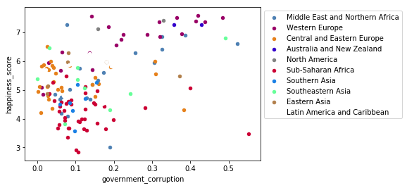

# Happiness study

We wanted to know the reasons that make people happy all arround the world. <br/>
Based on the World Happiness Report, we mainly focused on the year 2015. <br/>
Then we wanted to see if those reasons were related to suicides and terrorism acts.

# Loading datas into Hive


```python
#pip install pygal_maps_world & conda install -c conda-forge pyhamcrest  & pip install cairosvg & pycountry
import pandas as pd
from pyhive import hive
#Heat map
import seaborn as sns 
#Linear regression
import statsmodels.api as sm

import pygal.maps.world as pymap
import pycountry
```


```python
cursor = hive.connect('localhost').cursor()
cursor.execute('drop database if exists pjHive cascade')
cursor.execute('create database if not exists pjHive')
cursor.execute('use pjHive')
```


```python
# Happiness (3 different tables because we don't have the same datas for each year)
cursor.execute('drop table if exists happiness2015')
cursor.execute("create table if not exists happiness2015 (Country string,Region string,Happiness_Rank int,Happiness_Score float,Standard_Error float,GDP_Per_Capita float,Family float,Life_Expectancy float,Freedom float,Government_Corruption float,Generosity float,Dystopia_Residual float) "\
               +"row format delimited fields terminated by ',' "\
               +"stored as textfile "\
               +"tblproperties('skip.header.line.count'='1')");
cursor.execute("load data local inpath '/home/cloudera/Desktop/pjHive/2015.csv' into table happiness2015")

cursor.execute('drop table if exists happiness2016')
cursor.execute("create table if not exists happiness2016 (Country string,Region string,Happiness_Rank int,Happiness_Score float,Lower_Confidence_Interval float,Upper_Confidence_Interval float,GDP_per_Capita float,Family float,Life_Expectancy float,Freedom float,Government_Corruption float,Generosity float,Dystopia_Residual float) "\
               +"row format delimited fields terminated by ',' "\
               +"stored as textfile "\
               +"tblproperties('skip.header.line.count'='1')");
cursor.execute("load data local inpath '/home/cloudera/Desktop/pjHive/2016.csv' into table happiness2016")

cursor.execute('drop table if exists happiness2017')
cursor.execute("create table if not exists happiness2017 (Country string,Happiness_Rank int ,Happiness_Score float,Whisker_high float,Whisker_low float,GDP_per_Capita float,Family float,Life_Expectancy float,Freedom float,Generosity float,Government_Corruption float,Dystopia_Residual float) "\
               +"row format delimited fields terminated by ',' "\
               +"stored as textfile "\
               +"tblproperties('skip.header.line.count'='1')");
cursor.execute("load data local inpath '/home/cloudera/Desktop/pjHive/2017.csv' into table happiness2017")


#Terrorism
cursor.execute('drop table if exists terrorism')
cursor.execute("create table if not exists terrorism (eventid string,iyear string,imonth string,iday string,approxdate string,extend string,resolution string,country string,country_txt string,region string,region_txt string,provstate string,city string,latitude string,longitude string,specificity string,vicinity string,location string,summary string,crit1 string,crit2 string,crit3 string,doubtterr string,alternative string,alternative_txt string,multiple string,success string,suicide string,attacktype1 string,attacktype1_txt string,attacktype2 string,attacktype2_txt string,attacktype3 string,attacktype3_txt string,targtype1 string,targtype1_txt string,targsubtype1 string,targsubtype1_txt string,corp1 string,target1 string,natlty1 string,natlty1_txt string,targtype2 string,targtype2_txt string,targsubtype2 string,targsubtype2_txt string,corp2 string,target2 string,natlty2 string,natlty2_txt string,targtype3 string,targtype3_txt string,targsubtype3 string,targsubtype3_txt string,corp3 string,target3 string,natlty3 string,natlty3_txt string,gname string,gsubname string,gname2 string,gsubname2 string,gname3 string,gsubname3 string,motive string,guncertain1 string,guncertain2 string,guncertain3 string,individual string,nperps string,nperpcap string,claimed string,claimmode string,claimmode_txt string,claim2 string,claimmode2 string,claimmode2_txt string,claim3 string,claimmode3 string,claimmode3_txt string,compclaim string,weaptype1 string,weaptype1_txt string,weapsubtype1 string,weapsubtype1_txt string,weaptype2 string,weaptype2_txt string,weapsubtype2 string,weapsubtype2_txt string,weaptype3 string,weaptype3_txt string,weapsubtype3 string,weapsubtype3_txt string,weaptype4 string,weaptype4_txt string,weapsubtype4 string,weapsubtype4_txt string,weapdetail string,nkill string,nkillus string,nkillter string,nwound string,nwoundus string,nwoundte string,property string,propextent string,propextent_txt string,propvalue string,propcomment string,ishostkid string,nhostkid string,nhostkidus string,nhours string,ndays string,divert string,kidhijcountry string,ransom string,ransomamt string,ransomamtus string,ransompaid string,ransompaidus string,ransomnote string,hostkidoutcome string,hostkidoutcome_txt string,nreleased string,addnotes string,scite1 string,scite2 string,scite3 string,dbsource string,INT_LOG string,INT_IDEO string,INT_MISC string,INT_ANY string,related string) "\
               +"row format delimited fields terminated by ',' "\
               +"stored as textfile "\
               +"tblproperties('skip.header.line.count'='1')");
cursor.execute("load data local inpath '/home/cloudera/Desktop/pjHive/terrorism.csv' into table terrorism")

#Suicide

cursor.execute('drop table if exists suicide')
cursor.execute("create table if not exists suicide (Country string, Sex string, y_2016 float, y_2015 float, y_2010 float, y_2000 float) "\
               +"row format delimited fields terminated by ',' "\
               +"stored as textfile "\
               +"tblproperties('skip.header.line.count'='1')");
cursor.execute("load data local inpath '/home/cloudera/Desktop/pjHive/data.csv' into table suicide")

cursor.execute('drop table if exists population')
cursor.execute("create table if not exists population (CountryName string ,CountryCode string,IndicatorName string,IndicatorCode string,y1960 int,y1961 bigint,y1962 bigint,y1963 bigint,y1964 bigint,y1965 bigint,y1966 bigint,y1967 bigint,y1968 bigint,y1969 bigint,y1970 bigint,y1971 bigint,y1972 bigint,y1973 bigint,y1974 bigint,y1975 bigint,y1976 bigint,y1977 bigint,y1978 bigint,y1979 bigint,y1980 bigint,y1981 bigint,y1982 bigint,y1983 bigint,y1984 bigint,y1985 bigint,y1986 bigint,y1987 bigint,y1988 bigint,y1989 bigint,y1990 bigint,y1991 bigint,y1992 bigint,y1993 bigint,y1994 bigint,y1995 bigint,y1996 bigint,y1997 bigint,y1998 bigint,y1999 bigint,y2000 bigint,y2001 bigint,y2002 bigint,y2003 bigint,y2004 bigint,y2005 bigint,y2006 bigint,y2007 bigint,y2008 bigint,y2009 bigint,y2010 bigint,y2011 bigint,y2012 bigint,y2013 bigint,y2014 bigint ,y2015 bigint,y2016 bigint,y2017 bigint) "\
               +"row format delimited fields terminated by ',' "\
               +"stored as textfile "\
               +"tblproperties('skip.header.line.count'='1')");
cursor.execute("load data local inpath '/home/cloudera/Desktop/pjHive/population.csv' into table population")

```

# Analysis


```python
#Correlation between different variables
cursor.execute('select  happiness_score, gdp_per_capita, family, life_expectancy, freedom, generosity, government_corruption,dystopia_residual from happiness2015')
linearRegressionHappiness = pd.DataFrame(cursor.fetchall(),columns=['Happiness_Score', 'GDP_per_capita', 'Family', 'Life_expectancy', 'Freedom', 'Generosity', 'Government_Corruption','Dystopia_Residual'])
devcore = linearRegressionHappiness.corr()

sns.heatmap(devcore, xticklabels=linearRegressionHappiness.columns,yticklabels=linearRegressionHappiness.columns,annot=True)

# As happiness is composed by the sum of other variables, we have a strong link between it and other variables.
# Moreover, we can see correlation between variables such as Life_expectancy and Economy (GDP_per_capita) or Family and Life_expectancy
# That means that the higher GDP_per_capita is, higher life_expectancy will be.
# BUT those variables don't contribute as much in the happiness calculation. Let's see how they contribute for each region
```


    <matplotlib.axes._subplots.AxesSubplot at 0x7f7283acbd68>


```python
# Avg value of variables per region
cursor.execute('select Country, Region,Happiness_Score,GDP_per_capita, Family, Life_expectancy, Freedom, Generosity, Government_Corruption,Dystopia_Residual from happiness2015')
rows = pd.DataFrame(cursor.fetchall(),columns=['Country', 'Region','Happiness_Score','GDP_per_capita', 'Family', 'Life_expectancy', 'Freedom', 'Generosity', 'Government_Corruption','Dystopia_Residual'])

rows = rows.groupby(["Region"]).mean()#.hist(by='Region',figsize = (15,20))
rows.plot.barh(subplots = True, figsize=(20,40))
```


    array([<matplotlib.axes._subplots.AxesSubplot object at 0x7f728eed1080>,
           <matplotlib.axes._subplots.AxesSubplot object at 0x7f728ee37dd8>,
           <matplotlib.axes._subplots.AxesSubplot object at 0x7f728ee66278>,
           <matplotlib.axes._subplots.AxesSubplot object at 0x7f728ee0f6d8>,
           <matplotlib.axes._subplots.AxesSubplot object at 0x7f728edb8b38>,
           <matplotlib.axes._subplots.AxesSubplot object at 0x7f728ede0f98>,
           <matplotlib.axes._subplots.AxesSubplot object at 0x7f728ed8f438>,
           <matplotlib.axes._subplots.AxesSubplot object at 0x7f728ed358d0>],
          dtype=object)


```python
# Have a look on the contribution of each variables to the happiness_score
cursor.execute('select h.country, h.region, h.happiness_score, h.gdp_per_capita, h.family, h.life_expectancy, h.freedom, h.generosity, h.government_corruption, h.dystopia_residual '\
                +'from happiness2015 h ')
variablesContribution = pd.DataFrame(cursor.fetchall(), columns = ['country', 'region',  'happiness_score', 'gdp_per_capita', 'family', 'life_expectancy', 'freedom', 'generosity', 'government_corruption', 'dystopia_residual'])

for i in variablesContribution.columns[4:]:
    variablesContribution[i] = variablesContribution[i].divide(variablesContribution["happiness_score"])*100
variablesContribution.sort_values(by = 'gdp_per_capita')
```


<div>
<style scoped>
    .dataframe tbody tr th:only-of-type {
        vertical-align: middle;
    }

    .dataframe tbody tr th {
        vertical-align: top;
    }

    .dataframe thead th {
        text-align: right;
    }
</style>
<table border="1" class="dataframe">
  <thead>
    <tr style="text-align: right;">
      <th></th>
      <th>country</th>
      <th>region</th>
      <th>happiness_score</th>
      <th>gdp_per_capita</th>
      <th>family</th>
      <th>life_expectancy</th>
      <th>freedom</th>
      <th>generosity</th>
      <th>government_corruption</th>
      <th>dystopia_residual</th>
    </tr>
  </thead>
  <tbody>
    <tr>
      <th>119</th>
      <td>Congo (Kinshasa)</td>
      <td>Sub-Saharan Africa</td>
      <td>4.517</td>
      <td>0.00000</td>
      <td>22.165152</td>
      <td>2.170910</td>
      <td>5.004428</td>
      <td>5.497896</td>
      <td>1.688067</td>
      <td>63.473985</td>
    </tr>
    <tr>
      <th>156</th>
      <td>Burundi</td>
      <td>Sub-Saharan Africa</td>
      <td>2.905</td>
      <td>0.01530</td>
      <td>14.315663</td>
      <td>7.709466</td>
      <td>4.079174</td>
      <td>6.790706</td>
      <td>3.463683</td>
      <td>63.098795</td>
    </tr>
    <tr>
      <th>130</th>
      <td>Malawi</td>
      <td>Sub-Saharan Africa</td>
      <td>4.292</td>
      <td>0.01604</td>
      <td>9.583877</td>
      <td>5.256757</td>
      <td>10.031221</td>
      <td>7.718546</td>
      <td>1.625583</td>
      <td>65.421950</td>
    </tr>
    <tr>
      <th>143</th>
      <td>Niger</td>
      <td>Sub-Saharan Africa</td>
      <td>3.845</td>
      <td>0.06940</td>
      <td>20.094928</td>
      <td>7.726138</td>
      <td>12.403641</td>
      <td>5.042132</td>
      <td>4.067360</td>
      <td>48.862678</td>
    </tr>
    <tr>
      <th>115</th>
      <td>Liberia</td>
      <td>Sub-Saharan Africa</td>
      <td>4.571</td>
      <td>0.07120</td>
      <td>17.275869</td>
      <td>7.482170</td>
      <td>6.241741</td>
      <td>5.329687</td>
      <td>1.363378</td>
      <td>60.758916</td>
    </tr>
    <tr>
      <th>147</th>
      <td>Central African Republic</td>
      <td>Sub-Saharan Africa</td>
      <td>3.678</td>
      <td>0.07850</td>
      <td>0.000000</td>
      <td>1.821370</td>
      <td>13.289560</td>
      <td>6.480424</td>
      <td>2.253670</td>
      <td>74.015771</td>
    </tr>
    <tr>
      <th>93</th>
      <td>Mozambique</td>
      <td>Sub-Saharan Africa</td>
      <td>4.971</td>
      <td>0.08308</td>
      <td>20.644940</td>
      <td>1.836854</td>
      <td>6.847113</td>
      <td>4.479783</td>
      <td>3.138805</td>
      <td>61.383420</td>
    </tr>
    <tr>
      <th>149</th>
      <td>Guinea</td>
      <td>Sub-Saharan Africa</td>
      <td>3.656</td>
      <td>0.17417</td>
      <td>12.711980</td>
      <td>6.567013</td>
      <td>10.318654</td>
      <td>7.838348</td>
      <td>3.320295</td>
      <td>54.478119</td>
    </tr>
    <tr>
      <th>90</th>
      <td>Somaliland region</td>
      <td>Sub-Saharan Africa</td>
      <td>5.057</td>
      <td>0.18847</td>
      <td>18.815899</td>
      <td>8.675697</td>
      <td>9.211390</td>
      <td>9.950168</td>
      <td>7.895590</td>
      <td>41.730671</td>
    </tr>
    <tr>
      <th>121</th>
      <td>Ethiopia</td>
      <td>Sub-Saharan Africa</td>
      <td>4.512</td>
      <td>0.19073</td>
      <td>13.387854</td>
      <td>9.763963</td>
      <td>9.629876</td>
      <td>5.391179</td>
      <td>3.335106</td>
      <td>54.272163</td>
    </tr>
    <tr>
      <th>146</th>
      <td>Madagascar</td>
      <td>Sub-Saharan Africa</td>
      <td>3.681</td>
      <td>0.20824</td>
      <td>18.147514</td>
      <td>12.692475</td>
      <td>5.211627</td>
      <td>5.795436</td>
      <td>2.207009</td>
      <td>50.285247</td>
    </tr>
    <tr>
      <th>157</th>
      <td>Togo</td>
      <td>Sub-Saharan Africa</td>
      <td>2.839</td>
      <td>0.20868</td>
      <td>4.929553</td>
      <td>10.018668</td>
      <td>12.840084</td>
      <td>5.875661</td>
      <td>3.779852</td>
      <td>55.204651</td>
    </tr>
    <tr>
      <th>140</th>
      <td>Uganda</td>
      <td>Sub-Saharan Africa</td>
      <td>3.931</td>
      <td>0.21102</td>
      <td>28.821928</td>
      <td>8.613839</td>
      <td>11.632409</td>
      <td>7.394047</td>
      <td>1.848639</td>
      <td>36.317985</td>
    </tr>
    <tr>
      <th>153</th>
      <td>Rwanda</td>
      <td>Sub-Saharan Africa</td>
      <td>3.465</td>
      <td>0.22208</td>
      <td>22.329005</td>
      <td>12.370563</td>
      <td>17.085427</td>
      <td>6.530448</td>
      <td>15.928138</td>
      <td>19.348341</td>
    </tr>
    <tr>
      <th>139</th>
      <td>Comoros</td>
      <td>Sub-Saharan Africa</td>
      <td>3.956</td>
      <td>0.23906</td>
      <td>20.038674</td>
      <td>9.179727</td>
      <td>5.792972</td>
      <td>4.408746</td>
      <td>5.030334</td>
      <td>49.497471</td>
    </tr>
    <tr>
      <th>151</th>
      <td>Burkina Faso</td>
      <td>Sub-Saharan Africa</td>
      <td>3.587</td>
      <td>0.25812</td>
      <td>23.749095</td>
      <td>7.562030</td>
      <td>11.010037</td>
      <td>6.062727</td>
      <td>3.577363</td>
      <td>40.840256</td>
    </tr>
    <tr>
      <th>137</th>
      <td>Mali</td>
      <td>Sub-Saharan Africa</td>
      <td>3.995</td>
      <td>0.26074</td>
      <td>25.913892</td>
      <td>5.152190</td>
      <td>9.726409</td>
      <td>4.705382</td>
      <td>3.091865</td>
      <td>44.879351</td>
    </tr>
    <tr>
      <th>118</th>
      <td>Haiti</td>
      <td>Latin America and Caribbean</td>
      <td>4.518</td>
      <td>0.26673</td>
      <td>16.445772</td>
      <td>8.598273</td>
      <td>5.406153</td>
      <td>10.222886</td>
      <td>3.801461</td>
      <td>49.617749</td>
    </tr>
    <tr>
      <th>114</th>
      <td>Zimbabwe</td>
      <td>Sub-Saharan Africa</td>
      <td>4.610</td>
      <td>0.27100</td>
      <td>22.402603</td>
      <td>7.261388</td>
      <td>5.609761</td>
      <td>4.118655</td>
      <td>1.752494</td>
      <td>52.969847</td>
    </tr>
    <tr>
      <th>128</th>
      <td>Myanmar</td>
      <td>Southeastern Asia</td>
      <td>4.307</td>
      <td>0.27108</td>
      <td>16.462734</td>
      <td>11.201764</td>
      <td>10.219874</td>
      <td>18.478755</td>
      <td>4.419317</td>
      <td>32.924309</td>
    </tr>
    <tr>
      <th>145</th>
      <td>Tanzania</td>
      <td>Sub-Saharan Africa</td>
      <td>3.781</td>
      <td>0.28520</td>
      <td>26.518910</td>
      <td>10.107115</td>
      <td>8.695583</td>
      <td>9.092039</td>
      <td>1.519968</td>
      <td>36.519176</td>
    </tr>
    <tr>
      <th>154</th>
      <td>Benin</td>
      <td>Sub-Saharan Africa</td>
      <td>3.340</td>
      <td>0.28665</td>
      <td>10.594611</td>
      <td>9.553892</td>
      <td>14.505988</td>
      <td>5.467066</td>
      <td>2.398204</td>
      <td>48.900601</td>
    </tr>
    <tr>
      <th>152</th>
      <td>Afghanistan</td>
      <td>Southern Asia</td>
      <td>3.575</td>
      <td>0.31982</td>
      <td>8.471329</td>
      <td>8.485315</td>
      <td>6.549370</td>
      <td>10.212587</td>
      <td>2.718601</td>
      <td>54.604196</td>
    </tr>
    <tr>
      <th>122</th>
      <td>Sierra Leone</td>
      <td>Sub-Saharan Africa</td>
      <td>4.507</td>
      <td>0.33024</td>
      <td>21.205014</td>
      <td>0.000000</td>
      <td>9.061460</td>
      <td>4.767695</td>
      <td>1.949412</td>
      <td>55.693147</td>
    </tr>
    <tr>
      <th>148</th>
      <td>Chad</td>
      <td>Sub-Saharan Africa</td>
      <td>3.667</td>
      <td>0.34193</td>
      <td>20.742296</td>
      <td>4.093264</td>
      <td>6.408781</td>
      <td>5.013908</td>
      <td>1.436869</td>
      <td>52.985001</td>
    </tr>
    <tr>
      <th>120</th>
      <td>Nepal</td>
      <td>Southern Asia</td>
      <td>4.514</td>
      <td>0.35997</td>
      <td>19.151307</td>
      <td>12.599469</td>
      <td>8.480727</td>
      <td>7.154630</td>
      <td>1.308595</td>
      <td>43.340054</td>
    </tr>
    <tr>
      <th>124</th>
      <td>Kenya</td>
      <td>Sub-Saharan Africa</td>
      <td>4.419</td>
      <td>0.36471</td>
      <td>22.601492</td>
      <td>9.376556</td>
      <td>9.553066</td>
      <td>8.495587</td>
      <td>1.321340</td>
      <td>40.406199</td>
    </tr>
    <tr>
      <th>141</th>
      <td>Senegal</td>
      <td>Sub-Saharan Africa</td>
      <td>3.904</td>
      <td>0.36498</td>
      <td>25.004866</td>
      <td>11.152664</td>
      <td>9.419057</td>
      <td>5.338883</td>
      <td>2.744109</td>
      <td>36.986425</td>
    </tr>
    <tr>
      <th>96</th>
      <td>Lesotho</td>
      <td>Sub-Saharan Africa</td>
      <td>4.898</td>
      <td>0.37545</td>
      <td>21.254187</td>
      <td>1.554104</td>
      <td>6.485709</td>
      <td>3.345856</td>
      <td>2.552879</td>
      <td>57.131894</td>
    </tr>
    <tr>
      <th>105</th>
      <td>Tajikistan</td>
      <td>Central and Eastern Europe</td>
      <td>4.786</td>
      <td>0.39047</td>
      <td>17.877769</td>
      <td>11.988927</td>
      <td>9.865442</td>
      <td>4.800251</td>
      <td>3.149185</td>
      <td>44.170292</td>
    </tr>
    <tr>
      <th>...</th>
      <td>...</td>
      <td>...</td>
      <td>...</td>
      <td>...</td>
      <td>...</td>
      <td>...</td>
      <td>...</td>
      <td>...</td>
      <td>...</td>
      <td>...</td>
    </tr>
    <tr>
      <th>46</th>
      <td>South Korea</td>
      <td>Eastern Asia</td>
      <td>5.984</td>
      <td>1.24461</td>
      <td>16.005013</td>
      <td>16.132687</td>
      <td>5.549465</td>
      <td>3.101103</td>
      <td>1.313001</td>
      <td>37.095252</td>
    </tr>
    <tr>
      <th>8</th>
      <td>New Zealand</td>
      <td>Australia and New Zealand</td>
      <td>7.286</td>
      <td>1.25018</td>
      <td>18.112407</td>
      <td>12.467335</td>
      <td>8.775460</td>
      <td>6.519490</td>
      <td>5.891024</td>
      <td>31.076724</td>
    </tr>
    <tr>
      <th>49</th>
      <td>Italy</td>
      <td>Western Europe</td>
      <td>5.948</td>
      <td>1.25114</td>
      <td>20.137357</td>
      <td>16.046739</td>
      <td>4.410895</td>
      <td>3.837088</td>
      <td>0.487727</td>
      <td>34.048085</td>
    </tr>
    <tr>
      <th>20</th>
      <td>United Kingdom</td>
      <td>Western Europe</td>
      <td>6.867</td>
      <td>1.26637</td>
      <td>18.719674</td>
      <td>13.243484</td>
      <td>8.682831</td>
      <td>7.559633</td>
      <td>4.669725</td>
      <td>28.687053</td>
    </tr>
    <tr>
      <th>45</th>
      <td>Japan</td>
      <td>Eastern Asia</td>
      <td>5.987</td>
      <td>1.27074</td>
      <td>20.997495</td>
      <td>16.554368</td>
      <td>8.287122</td>
      <td>1.788041</td>
      <td>3.016536</td>
      <td>28.133456</td>
    </tr>
    <tr>
      <th>28</th>
      <td>France</td>
      <td>Western Europe</td>
      <td>6.575</td>
      <td>1.27778</td>
      <td>19.169279</td>
      <td>14.384639</td>
      <td>8.366692</td>
      <td>1.875589</td>
      <td>3.140076</td>
      <td>33.631333</td>
    </tr>
    <tr>
      <th>5</th>
      <td>Finland</td>
      <td>Western Europe</td>
      <td>7.406</td>
      <td>1.29025</td>
      <td>17.799891</td>
      <td>12.005266</td>
      <td>8.664461</td>
      <td>3.152984</td>
      <td>5.586281</td>
      <td>35.370645</td>
    </tr>
    <tr>
      <th>37</th>
      <td>Taiwan</td>
      <td>Eastern Asia</td>
      <td>6.298</td>
      <td>1.29098</td>
      <td>17.087488</td>
      <td>13.898063</td>
      <td>6.309940</td>
      <td>4.029216</td>
      <td>1.290727</td>
      <td>36.888379</td>
    </tr>
    <tr>
      <th>1</th>
      <td>Iceland</td>
      <td>Western Europe</td>
      <td>7.561</td>
      <td>1.30232</td>
      <td>18.545563</td>
      <td>12.535908</td>
      <td>8.315964</td>
      <td>5.770401</td>
      <td>1.870784</td>
      <td>35.736146</td>
    </tr>
    <tr>
      <th>18</th>
      <td>Belgium</td>
      <td>Western Europe</td>
      <td>6.937</td>
      <td>1.30782</td>
      <td>18.533373</td>
      <td>12.925905</td>
      <td>8.425833</td>
      <td>3.207438</td>
      <td>3.249243</td>
      <td>34.811014</td>
    </tr>
    <tr>
      <th>48</th>
      <td>Bahrain</td>
      <td>Middle East and Northern Africa</td>
      <td>5.960</td>
      <td>1.32376</td>
      <td>20.406712</td>
      <td>12.536242</td>
      <td>7.632886</td>
      <td>2.913087</td>
      <td>5.134228</td>
      <td>29.160570</td>
    </tr>
    <tr>
      <th>2</th>
      <td>Denmark</td>
      <td>Western Europe</td>
      <td>7.527</td>
      <td>1.32548</td>
      <td>18.075993</td>
      <td>11.620034</td>
      <td>8.627342</td>
      <td>4.535539</td>
      <td>6.424472</td>
      <td>33.108010</td>
    </tr>
    <tr>
      <th>4</th>
      <td>Canada</td>
      <td>North America</td>
      <td>7.427</td>
      <td>1.32629</td>
      <td>17.808133</td>
      <td>12.193752</td>
      <td>8.522552</td>
      <td>6.168170</td>
      <td>4.437458</td>
      <td>33.011445</td>
    </tr>
    <tr>
      <th>25</th>
      <td>Germany</td>
      <td>Western Europe</td>
      <td>6.750</td>
      <td>1.32792</td>
      <td>19.249927</td>
      <td>13.212741</td>
      <td>9.107704</td>
      <td>4.179852</td>
      <td>3.236000</td>
      <td>31.343555</td>
    </tr>
    <tr>
      <th>6</th>
      <td>Netherlands</td>
      <td>Western Europe</td>
      <td>7.378</td>
      <td>1.32944</td>
      <td>17.351179</td>
      <td>12.101383</td>
      <td>8.345894</td>
      <td>6.452968</td>
      <td>4.312009</td>
      <td>33.419626</td>
    </tr>
    <tr>
      <th>7</th>
      <td>Sweden</td>
      <td>Western Europe</td>
      <td>7.364</td>
      <td>1.33171</td>
      <td>17.505025</td>
      <td>12.369229</td>
      <td>8.959805</td>
      <td>4.924226</td>
      <td>5.953829</td>
      <td>32.199757</td>
    </tr>
    <tr>
      <th>9</th>
      <td>Australia</td>
      <td>Australia and New Zealand</td>
      <td>7.284</td>
      <td>1.33358</td>
      <td>17.974053</td>
      <td>12.789127</td>
      <td>8.940692</td>
      <td>5.980505</td>
      <td>4.892504</td>
      <td>31.115595</td>
    </tr>
    <tr>
      <th>17</th>
      <td>Ireland</td>
      <td>Western Europe</td>
      <td>6.940</td>
      <td>1.33596</td>
      <td>19.733141</td>
      <td>12.901009</td>
      <td>8.901585</td>
      <td>6.613977</td>
      <td>4.135879</td>
      <td>28.468300</td>
    </tr>
    <tr>
      <th>12</th>
      <td>Austria</td>
      <td>Western Europe</td>
      <td>7.200</td>
      <td>1.33723</td>
      <td>18.014445</td>
      <td>12.366945</td>
      <td>8.671250</td>
      <td>4.595555</td>
      <td>2.593889</td>
      <td>35.183335</td>
    </tr>
    <tr>
      <th>21</th>
      <td>Oman</td>
      <td>Middle East and Northern Africa</td>
      <td>6.853</td>
      <td>1.36011</td>
      <td>15.786079</td>
      <td>11.130307</td>
      <td>9.233037</td>
      <td>3.143441</td>
      <td>4.745950</td>
      <td>36.113964</td>
    </tr>
    <tr>
      <th>71</th>
      <td>Hong Kong</td>
      <td>Eastern Asia</td>
      <td>5.474</td>
      <td>1.38604</td>
      <td>19.331019</td>
      <td>18.510779</td>
      <td>10.889295</td>
      <td>7.211911</td>
      <td>6.781878</td>
      <td>11.952686</td>
    </tr>
    <tr>
      <th>14</th>
      <td>United States</td>
      <td>North America</td>
      <td>7.119</td>
      <td>1.39451</td>
      <td>17.518051</td>
      <td>12.105492</td>
      <td>7.670178</td>
      <td>5.633516</td>
      <td>2.232055</td>
      <td>35.259305</td>
    </tr>
    <tr>
      <th>34</th>
      <td>Saudi Arabia</td>
      <td>Middle East and Northern Africa</td>
      <td>6.411</td>
      <td>1.39541</td>
      <td>16.907348</td>
      <td>11.234597</td>
      <td>4.842926</td>
      <td>2.137888</td>
      <td>5.073155</td>
      <td>38.039621</td>
    </tr>
    <tr>
      <th>0</th>
      <td>Switzerland</td>
      <td>Western Europe</td>
      <td>7.587</td>
      <td>1.39651</td>
      <td>17.787136</td>
      <td>12.408462</td>
      <td>8.772506</td>
      <td>3.911691</td>
      <td>5.532885</td>
      <td>33.180177</td>
    </tr>
    <tr>
      <th>19</th>
      <td>United Arab Emirates</td>
      <td>Middle East and Northern Africa</td>
      <td>6.901</td>
      <td>1.42727</td>
      <td>16.312852</td>
      <td>11.726561</td>
      <td>9.296768</td>
      <td>3.829590</td>
      <td>5.590929</td>
      <td>32.566731</td>
    </tr>
    <tr>
      <th>3</th>
      <td>Norway</td>
      <td>Western Europe</td>
      <td>7.522</td>
      <td>1.45900</td>
      <td>17.694098</td>
      <td>11.768280</td>
      <td>8.903616</td>
      <td>4.613002</td>
      <td>4.852832</td>
      <td>32.774663</td>
    </tr>
    <tr>
      <th>23</th>
      <td>Singapore</td>
      <td>Southeastern Asia</td>
      <td>6.798</td>
      <td>1.52186</td>
      <td>15.004413</td>
      <td>15.081641</td>
      <td>7.980582</td>
      <td>4.575611</td>
      <td>7.238894</td>
      <td>27.728891</td>
    </tr>
    <tr>
      <th>38</th>
      <td>Kuwait</td>
      <td>Middle East and Northern Africa</td>
      <td>6.295</td>
      <td>1.55422</td>
      <td>18.521684</td>
      <td>11.515806</td>
      <td>8.816362</td>
      <td>2.577919</td>
      <td>4.068149</td>
      <td>29.806831</td>
    </tr>
    <tr>
      <th>16</th>
      <td>Luxembourg</td>
      <td>Western Europe</td>
      <td>6.946</td>
      <td>1.56391</td>
      <td>17.558739</td>
      <td>13.229772</td>
      <td>8.865966</td>
      <td>4.035992</td>
      <td>5.441693</td>
      <td>28.356031</td>
    </tr>
    <tr>
      <th>27</th>
      <td>Qatar</td>
      <td>Middle East and Northern Africa</td>
      <td>6.611</td>
      <td>1.69042</td>
      <td>16.315233</td>
      <td>12.060657</td>
      <td>9.686885</td>
      <td>4.927091</td>
      <td>7.897141</td>
      <td>23.547724</td>
    </tr>
  </tbody>
</table>
<p>158 rows × 10 columns</p>
</div>


### Relation with terrorism

Let's see if terrorism and happiness are related.


```python
# First let's have a view on map of happiness_score and terrorist attack number

# Map with happiness_score
worldmap_chart_happiness = pymap.World()
cursor.execute('select country, happiness_score from happiness2015')
rows = pd.DataFrame(cursor.fetchall(),columns=['country','happiness_score'])
def transform(x):
    try:
        return pycountry.countries.lookup(x).alpha_2.lower()
    except :
        return x

rows["country"] = rows["country"].apply(lambda x:transform(x))
worldmap_chart_happiness.add('In 2015', rows.set_index(["country"])["happiness_score"].to_dict())
worldmap_chart_happiness
```


```python
# Map with terrorist attacks
cursor.execute('select iyear, country_txt, region_txt, gname, nkill from terrorism')
terrorism = pd.DataFrame(cursor.fetchall(),columns=['iyear','country_txt','region_txt','gname','nkill'])

terrorism["country_txt"] = terrorism["country_txt"].apply(lambda x:transform(x))
terrorism.loc[terrorism["iyear"] == "2015"].groupby("country_txt")["nkill"].count()

#Repartition of terrorist attack arround the world
worldmap_chart_terrorism = pymap.World()
worldmap_chart_terrorism.add('In 2015', terrorism.loc[terrorism["iyear"] == "2015"].groupby("country_txt")["nkill"].count().to_dict())
worldmap_chart_terrorism
```


```python
#Looks like, the lower happiness score you have, higher will be your terrorist attack number
#Heatmap to see links between nb of attacks and different variables of happiness table
cursor.execute('select h.country, h.region, t.count,  h.happiness_score, h.gdp_per_capita, h.family, h.life_expectancy, h.freedom, h.generosity, h.government_corruption, h.dystopia_residual '\
                +'from happiness2015 h '\
                +'join (Select country_txt as country, count(*) as count from terrorism group by country_txt) t on t.country = h.country')
terrorismHappiness = pd.DataFrame(cursor.fetchall(), columns = ['country', 'region', 'attacks',  'happiness_score', 'gdp_per_capita', 'family', 'life_expectancy', 'freedom', 'generosity', 'government_corruption', 'dystopia_residual'])
devcore = terrorismHappiness.corr()
sns.heatmap(devcore, xticklabels=terrorismHappiness.columns[2:],yticklabels=terrorismHappiness.columns[2:],annot=True, linewidths=.5)
```


    <matplotlib.axes._subplots.AxesSubplot at 0x7f7283389240>


### Suicide

Our principal dataset is about the happiness in the world. <br/>
So we thought that suicide and the hapiness of the population might be related in some way. <br/>
We will see if it's true or not.<br/>
In the suicide dataset we took only the year 2015. 
It contains the countries, the number of suicides in the country per year.


```python
# We display the 5 countries affected by the most numbers of suicide
cursor.execute('select s.Country, (s.y_2015 * population.y2015)/100000 , h2015.Happiness_Score, h2015.gdp_per_capita, h2015.family, h2015.life_expectancy, h2015.freedom, h2015.generosity, h2015.government_corruption,h2015.dystopia_residual from suicide s inner join happiness2015 h2015 on s.Country = h2015.Country inner join population on s.Country = population.CountryName where s.Sex="Both sexes"  ')
suicideRows = pd.DataFrame(cursor.fetchall(),columns=['country','suicide', 'Happiness_Score', 'GDP_per_capita', 'Family', 'Life_expectancy', 'Freedom', 'Generosity', 'Government_Corruption','Dystopia_Residual'])

suicideRows.nlargest(5, 'suicide')
```


<div>
<style scoped>
    .dataframe tbody tr th:only-of-type {
        vertical-align: middle;
    }

    .dataframe tbody tr th {
        vertical-align: top;
    }

    .dataframe thead th {
        text-align: right;
    }
</style>
<table border="1" class="dataframe">
  <thead>
    <tr style="text-align: right;">
      <th></th>
      <th>country</th>
      <th>suicide</th>
      <th>Happiness_Score</th>
      <th>GDP_per_capita</th>
      <th>Family</th>
      <th>Life_expectancy</th>
      <th>Freedom</th>
      <th>Generosity</th>
      <th>Government_Corruption</th>
      <th>Dystopia_Residual</th>
    </tr>
  </thead>
  <tbody>
    <tr>
      <th>54</th>
      <td>India</td>
      <td>216074.52672</td>
      <td>4.565</td>
      <td>0.64499</td>
      <td>0.38174</td>
      <td>0.51529</td>
      <td>0.39786</td>
      <td>0.26475</td>
      <td>0.08492</td>
      <td>2.27513</td>
    </tr>
    <tr>
      <th>25</th>
      <td>China</td>
      <td>110505.87136</td>
      <td>5.140</td>
      <td>0.89012</td>
      <td>0.94675</td>
      <td>0.81658</td>
      <td>0.51697</td>
      <td>0.08185</td>
      <td>0.02781</td>
      <td>1.86040</td>
    </tr>
    <tr>
      <th>89</th>
      <td>Nigeria</td>
      <td>30880.58624</td>
      <td>5.268</td>
      <td>0.65435</td>
      <td>0.90432</td>
      <td>0.16007</td>
      <td>0.34334</td>
      <td>0.27233</td>
      <td>0.04030</td>
      <td>2.89319</td>
    </tr>
    <tr>
      <th>62</th>
      <td>Japan</td>
      <td>19218.67648</td>
      <td>5.987</td>
      <td>1.27074</td>
      <td>1.25712</td>
      <td>0.99111</td>
      <td>0.49615</td>
      <td>0.10705</td>
      <td>0.18060</td>
      <td>1.68435</td>
    </tr>
    <tr>
      <th>18</th>
      <td>Brazil</td>
      <td>12661.21344</td>
      <td>6.983</td>
      <td>0.98124</td>
      <td>1.23287</td>
      <td>0.69702</td>
      <td>0.49049</td>
      <td>0.14574</td>
      <td>0.17521</td>
      <td>3.26001</td>
    </tr>
  </tbody>
</table>
</div>


```python
# Percentage of suicides per country to see globaly
cursor.execute('select s.Country, (((s.y_2015 * population.y2015)/100000)/ population.y2015)*100 from suicide s inner join population on s.Country = population.CountryName where s.Sex="Both sexes" ')
Suicidetest = pd.DataFrame(cursor.fetchall(),columns=['Country', 'suicidePercentage'])
Suicidetest.nlargest(20, 'suicidePercentage')
```


<div>
<style scoped>
    .dataframe tbody tr th:only-of-type {
        vertical-align: middle;
    }

    .dataframe tbody tr th {
        vertical-align: top;
    }

    .dataframe thead th {
        text-align: right;
    }
</style>
<table border="1" class="dataframe">
  <thead>
    <tr style="text-align: right;">
      <th></th>
      <th>Country</th>
      <th>suicidePercentage</th>
    </tr>
  </thead>
  <tbody>
    <tr>
      <th>64</th>
      <td>Guyana</td>
      <td>0.0303</td>
    </tr>
    <tr>
      <th>89</th>
      <td>Lithuania</td>
      <td>0.0288</td>
    </tr>
    <tr>
      <th>88</th>
      <td>Lesotho</td>
      <td>0.0285</td>
    </tr>
    <tr>
      <th>125</th>
      <td>Russian Federation</td>
      <td>0.0275</td>
    </tr>
    <tr>
      <th>79</th>
      <td>Kazakhstan</td>
      <td>0.0252</td>
    </tr>
    <tr>
      <th>138</th>
      <td>Suriname</td>
      <td>0.0244</td>
    </tr>
    <tr>
      <th>60</th>
      <td>Equatorial Guinea</td>
      <td>0.0220</td>
    </tr>
    <tr>
      <th>19</th>
      <td>Belarus</td>
      <td>0.0212</td>
    </tr>
    <tr>
      <th>154</th>
      <td>Uganda</td>
      <td>0.0202</td>
    </tr>
    <tr>
      <th>31</th>
      <td>Cameroon</td>
      <td>0.0196</td>
    </tr>
    <tr>
      <th>155</th>
      <td>Ukraine</td>
      <td>0.0190</td>
    </tr>
    <tr>
      <th>163</th>
      <td>Zimbabwe</td>
      <td>0.0189</td>
    </tr>
    <tr>
      <th>108</th>
      <td>Nigeria</td>
      <td>0.0175</td>
    </tr>
    <tr>
      <th>156</th>
      <td>Uruguay</td>
      <td>0.0174</td>
    </tr>
    <tr>
      <th>91</th>
      <td>Latvia</td>
      <td>0.0173</td>
    </tr>
    <tr>
      <th>70</th>
      <td>India</td>
      <td>0.0167</td>
    </tr>
    <tr>
      <th>141</th>
      <td>Eswatini</td>
      <td>0.0165</td>
    </tr>
    <tr>
      <th>145</th>
      <td>Togo</td>
      <td>0.0163</td>
    </tr>
    <tr>
      <th>144</th>
      <td>Chad</td>
      <td>0.0157</td>
    </tr>
    <tr>
      <th>12</th>
      <td>Benin</td>
      <td>0.0157</td>
    </tr>
  </tbody>
</table>
</div>


```python
# We represent this percentage in the world map for better view of the situation
cursor.execute('select s.Country, (((s.y_2015 * population.y2015)/100000)/ population.y2015)*100 from suicide s inner join population on s.Country = population.CountryName where s.Sex="Both sexes" ')
Suicide = pd.DataFrame(cursor.fetchall(),columns=['Country', 'y_2015'])

Suicide["Country"] =Suicide["Country"].apply(lambda x:transform(x))

#Repartition of suicide arround the world
worldmap_chart_terrorism = pymap.World()
worldmap_chart_terrorism.add('In 2015',  Suicide.set_index(["Country"])["y_2015"].to_dict())
```


```python
# We calculate the average percentage of suicide in the world 
cursor.execute('select AVG((((s.y_2015 * population.y2015)/100000)/ population.y2015)*100) from suicide s inner join population on s.Country = population.CountryName where s.Sex="Both sexes" ')
avgSuicide = pd.DataFrame(cursor.fetchall(),columns=['Suicide'])
avgSuicide
```


<div>
<style scoped>
    .dataframe tbody tr th:only-of-type {
        vertical-align: middle;
    }

    .dataframe tbody tr th {
        vertical-align: top;
    }

    .dataframe thead th {
        text-align: right;
    }
</style>
<table border="1" class="dataframe">
  <thead>
    <tr style="text-align: right;">
      <th></th>
      <th>Suicide</th>
    </tr>
  </thead>
  <tbody>
    <tr>
      <th>0</th>
      <td>0.009734</td>
    </tr>
  </tbody>
</table>
</div>


```python
# We compared the 8 countries with the largest GDP per capita with the average suicide in the world
cursor.execute('select s.Country, (((s.y_2015 * population.y2015)/100000)/ population.y2015)*100 , h2015.Happiness_Score, (h2015.gdp_per_capita/h2015.Happiness_Score)*100, (h2015.family/h2015.Happiness_Score)*100, (h2015.life_expectancy/h2015.Happiness_Score)*100, (h2015.freedom/h2015.Happiness_Score)*100, (h2015.generosity/h2015.Happiness_Score)*100, (h2015.government_corruption/h2015.Happiness_Score)*100,(h2015.dystopia_residual/h2015.Happiness_Score)*100 from suicide s inner join happiness2015 h2015 on s.Country = h2015.Country inner join population on s.Country = population.CountryName where s.Sex="Both sexes"  ')

Suicidetest = pd.DataFrame(cursor.fetchall(),columns=['Country','Suicide', 'Happiness_Score', 'GDP_per_capita', 'Family', 'Life_expectancy', 'Freedom', 'Generosity', 'Government_Corruption','Dystopia_Residual'])
Suicidetest.nlargest(8, 'GDP_per_capita')
```


<div>
<style scoped>
    .dataframe tbody tr th:only-of-type {
        vertical-align: middle;
    }

    .dataframe tbody tr th {
        vertical-align: top;
    }

    .dataframe thead th {
        text-align: right;
    }
</style>
<table border="1" class="dataframe">
  <thead>
    <tr style="text-align: right;">
      <th></th>
      <th>Country</th>
      <th>Suicide</th>
      <th>Happiness_Score</th>
      <th>GDP_per_capita</th>
      <th>Family</th>
      <th>Life_expectancy</th>
      <th>Freedom</th>
      <th>Generosity</th>
      <th>Government_Corruption</th>
      <th>Dystopia_Residual</th>
    </tr>
  </thead>
  <tbody>
    <tr>
      <th>43</th>
      <td>Gabon</td>
      <td>0.0099</td>
      <td>3.896</td>
      <td>27.213554</td>
      <td>23.236140</td>
      <td>11.132444</td>
      <td>8.191478</td>
      <td>1.751027</td>
      <td>2.846766</td>
      <td>25.640401</td>
    </tr>
    <tr>
      <th>103</th>
      <td>Qatar</td>
      <td>0.0057</td>
      <td>6.611</td>
      <td>25.569808</td>
      <td>16.315233</td>
      <td>12.060657</td>
      <td>9.686885</td>
      <td>4.927091</td>
      <td>7.897141</td>
      <td>23.547724</td>
    </tr>
    <tr>
      <th>66</th>
      <td>Kuwait</td>
      <td>0.0022</td>
      <td>6.295</td>
      <td>24.689753</td>
      <td>18.521684</td>
      <td>11.515806</td>
      <td>8.816362</td>
      <td>2.577919</td>
      <td>4.068149</td>
      <td>29.806831</td>
    </tr>
    <tr>
      <th>14</th>
      <td>Bulgaria</td>
      <td>0.0079</td>
      <td>4.218</td>
      <td>23.996206</td>
      <td>26.224278</td>
      <td>18.171882</td>
      <td>7.251541</td>
      <td>2.826221</td>
      <td>0.206733</td>
      <td>21.334993</td>
    </tr>
    <tr>
      <th>47</th>
      <td>Greece</td>
      <td>0.0036</td>
      <td>4.857</td>
      <td>23.760758</td>
      <td>19.133828</td>
      <td>18.162035</td>
      <td>1.585135</td>
      <td>0.000000</td>
      <td>0.287626</td>
      <td>37.080709</td>
    </tr>
    <tr>
      <th>52</th>
      <td>Hungary</td>
      <td>0.0147</td>
      <td>4.800</td>
      <td>23.352915</td>
      <td>25.044790</td>
      <td>15.813541</td>
      <td>6.690000</td>
      <td>2.666667</td>
      <td>0.574583</td>
      <td>25.848748</td>
    </tr>
    <tr>
      <th>20</th>
      <td>Botswana</td>
      <td>0.0120</td>
      <td>4.332</td>
      <td>22.935135</td>
      <td>25.499540</td>
      <td>1.102493</td>
      <td>11.425439</td>
      <td>2.414820</td>
      <td>2.879501</td>
      <td>33.744461</td>
    </tr>
    <tr>
      <th>101</th>
      <td>Portugal</td>
      <td>0.0086</td>
      <td>5.102</td>
      <td>22.734416</td>
      <td>22.331439</td>
      <td>17.153861</td>
      <td>10.088004</td>
      <td>2.688945</td>
      <td>0.211290</td>
      <td>24.786748</td>
    </tr>
  </tbody>
</table>
</div>


```python
# Study of the correlation between the percentage of suicide and the different aspects of happiness

cursor.execute('select (((s.y_2015 * population.y2015)/100000)/ population.y2015)*100 , h2015.Happiness_Score, (h2015.gdp_per_capita/h2015.Happiness_Score)*100, (h2015.family/h2015.Happiness_Score)*100, (h2015.life_expectancy/h2015.Happiness_Score)*100, (h2015.freedom/h2015.Happiness_Score)*100, (h2015.generosity/h2015.Happiness_Score)*100, (h2015.government_corruption/h2015.Happiness_Score)*100,(h2015.dystopia_residual/h2015.Happiness_Score)*100 from suicide s inner join happiness2015 h2015 on s.Country = h2015.Country inner join population on s.Country = population.CountryName where s.Sex="Both sexes"  ')

correlationSuicide = pd.DataFrame(cursor.fetchall(),columns=['Suicide', 'Happiness_Score', 'GDP_per_capita', 'Family', 'Life_expectancy', 'Freedom', 'Generosity', 'Government_Corruption','Dystopia_Residual'])
correlationSuicide.head(10)
devcore = correlationSuicide.corr()

sns.heatmap(devcore, xticklabels=correlationSuicide.columns,yticklabels=correlationSuicide.columns,annot=True)
```


    <matplotlib.axes._subplots.AxesSubplot at 0x7f728347e438>


### Segmentation & Regressions


```python
# Trying to see if regions are grouped according to one variable
cursor.execute('select country, region, happiness_score , gdp_per_capita, family, life_expectancy, freedom, generosity, government_corruption from happiness2015')
repartition = pd.DataFrame(cursor.fetchall(),columns=['country', 'region','happiness_score','gdp_per_capita', 'family', 'life_expectancy', 'freedom', 'generosity', 'government_corruption'])
for i in repartition.columns[3:]:
    cpt = 0
    ax = ""
    for j in set(repartition["region"]):
        cpt += 1/len(set(repartition["region"]))
        if ax:
            ax = repartition.loc[repartition["region"]==j].plot(kind='scatter', x=i, y='happiness_score', ax = ax, color=(cpt*3%1,cpt*5%1,cpt*7%1))
        else: 
            ax = repartition.loc[repartition["region"]==j].plot(kind='scatter', x=i, y='happiness_score', color=(cpt*3%1,cpt*5%1,cpt*7%1))
    ax.legend(set(repartition["region"]),bbox_to_anchor=(1.0, 1.0))

# For example, we can see that Sub-Saharian is grouped on the bottom left corner.
# Otherwise, points are to grouped to see any kind of groups
```





```python
# Linear regression of Happiness Score regarding variables 


# (gdp_per_capita, family, life_expectancy, freedom, generosity, government_corruption)
X = linearRegression[linearRegression.columns[1:7]]
Y = linearRegression['Happiness_Score']
X = sm.add_constant(X)

model = sm.OLS(Y, X).fit()
predictions = model.predict(X)
model.summary()
```


<table class="simpletable">
<caption>OLS Regression Results</caption>
<tr>
  <th>Dep. Variable:</th>     <td>Happiness_Score</td> <th>  R-squared:         </th> <td>   0.777</td>
</tr>
<tr>
  <th>Model:</th>                   <td>OLS</td>       <th>  Adj. R-squared:    </th> <td>   0.768</td>
</tr>
<tr>
  <th>Method:</th>             <td>Least Squares</td>  <th>  F-statistic:       </th> <td>   87.81</td>
</tr>
<tr>
  <th>Date:</th>             <td>Mon, 26 Nov 2018</td> <th>  Prob (F-statistic):</th> <td>1.04e-46</td>
</tr>
<tr>
  <th>Time:</th>                 <td>13:57:56</td>     <th>  Log-Likelihood:    </th> <td> -126.46</td>
</tr>
<tr>
  <th>No. Observations:</th>      <td>   158</td>      <th>  AIC:               </th> <td>   266.9</td>
</tr>
<tr>
  <th>Df Residuals:</th>          <td>   151</td>      <th>  BIC:               </th> <td>   288.3</td>
</tr>
<tr>
  <th>Df Model:</th>              <td>     6</td>      <th>                     </th>     <td> </td>   
</tr>
<tr>
  <th>Covariance Type:</th>      <td>nonrobust</td>    <th>                     </th>     <td> </td>   
</tr>
</table>
<table class="simpletable">
<tr>
            <td></td>               <th>coef</th>     <th>std err</th>      <th>t</th>      <th>P>|t|</th>  <th>[0.025</th>    <th>0.975]</th>  
</tr>
<tr>
  <th>const</th>                 <td>    1.8602</td> <td>    0.190</td> <td>    9.766</td> <td> 0.000</td> <td>    1.484</td> <td>    2.237</td>
</tr>
<tr>
  <th>GDP_per_capita</th>        <td>    0.8607</td> <td>    0.220</td> <td>    3.907</td> <td> 0.000</td> <td>    0.425</td> <td>    1.296</td>
</tr>
<tr>
  <th>Family</th>                <td>    1.4089</td> <td>    0.223</td> <td>    6.327</td> <td> 0.000</td> <td>    0.969</td> <td>    1.849</td>
</tr>
<tr>
  <th>Life_expectancy</th>       <td>    0.9753</td> <td>    0.316</td> <td>    3.084</td> <td> 0.002</td> <td>    0.350</td> <td>    1.600</td>
</tr>
<tr>
  <th>Freedom</th>               <td>    1.3334</td> <td>    0.385</td> <td>    3.463</td> <td> 0.001</td> <td>    0.573</td> <td>    2.094</td>
</tr>
<tr>
  <th>Generosity</th>            <td>    0.3889</td> <td>    0.391</td> <td>    0.995</td> <td> 0.321</td> <td>   -0.384</td> <td>    1.161</td>
</tr>
<tr>
  <th>Government_Corruption</th> <td>    0.7845</td> <td>    0.437</td> <td>    1.797</td> <td> 0.074</td> <td>   -0.078</td> <td>    1.647</td>
</tr>
</table>
<table class="simpletable">
<tr>
  <th>Omnibus:</th>       <td> 1.753</td> <th>  Durbin-Watson:     </th> <td>   1.506</td>
</tr>
<tr>
  <th>Prob(Omnibus):</th> <td> 0.416</td> <th>  Jarque-Bera (JB):  </th> <td>   1.324</td>
</tr>
<tr>
  <th>Skew:</th>          <td>-0.180</td> <th>  Prob(JB):          </th> <td>   0.516</td>
</tr>
<tr>
  <th>Kurtosis:</th>      <td> 3.268</td> <th>  Cond. No.          </th> <td>    21.2</td>
</tr>
</table><br/><br/>Warnings:<br/>[1] Standard Errors assume that the covariance matrix of the errors is correctly specified.


```python
#Linear regression of Happiness Score regarding variables
X = Suicidetest[['Happiness_Score', 'GDP_per_capita', 'Family', 'Life_expectancy', 'Freedom', 'Generosity', 'Government_Corruption','Dystopia_Residual']]
Y = Suicidetest['Suicide']
X = sm.add_constant(X)

model = sm.OLS(Y, X).fit()
predictions = model.predict(X)
print(model.summary())

sns.lmplot(x='Suicide', y='Happiness_Score', data=Suicidetest)
```

                                OLS Regression Results                            
    ==============================================================================
    Dep. Variable:                Suicide   R-squared:                       0.219
    Model:                            OLS   Adj. R-squared:                  0.169
    Method:                 Least Squares   F-statistic:                     4.322
    Date:                Mon, 26 Nov 2018   Prob (F-statistic):           0.000130
    Time:                        13:58:59   Log-Likelihood:                 520.97
    No. Observations:                 132   AIC:                            -1024.
    Df Residuals:                     123   BIC:                            -998.0
    Df Model:                           8                                         
    Covariance Type:            nonrobust                                         
    =========================================================================================
                                coef    std err          t      P>|t|      [0.025      0.975]
    -----------------------------------------------------------------------------------------
    const                    22.5040      7.445      3.023      0.003       7.766      37.242
    Happiness_Score           0.0001      0.000      0.326      0.745      -0.001       0.001
    GDP_per_capita           -0.2250      0.074     -3.022      0.003      -0.372      -0.078
    Family                   -0.2247      0.074     -3.018      0.003      -0.372      -0.077
    Life_expectancy          -0.2254      0.074     -3.027      0.003      -0.373      -0.078
    Freedom                  -0.2246      0.074     -3.018      0.003      -0.372      -0.077
    Generosity               -0.2252      0.074     -3.024      0.003      -0.373      -0.078
    Government_Corruption    -0.2252      0.074     -3.024      0.003      -0.373      -0.078
    Dystopia_Residual        -0.2250      0.074     -3.021      0.003      -0.372      -0.078
    ==============================================================================
    Omnibus:                       16.734   Durbin-Watson:                   1.486
    Prob(Omnibus):                  0.000   Jarque-Bera (JB):               21.412
    Skew:                           0.728   Prob(JB):                     2.24e-05
    Kurtosis:                       4.332   Cond. No.                     8.72e+05
    ==============================================================================
    
    Warnings:
    [1] Standard Errors assume that the covariance matrix of the errors is correctly specified.
    [2] The condition number is large, 8.72e+05. This might indicate that there are
    strong multicollinearity or other numerical problems.
    

    /home/cloudera/anaconda3/lib/python3.7/site-packages/scipy/stats/stats.py:1713: FutureWarning: Using a non-tuple sequence for multidimensional indexing is deprecated; use `arr[tuple(seq)]` instead of `arr[seq]`. In the future this will be interpreted as an array index, `arr[np.array(seq)]`, which will result either in an error or a different result.
      return np.add.reduce(sorted[indexer] * weights, axis=axis) / sumval
    


    <seaborn.axisgrid.FacetGrid at 0x7f7283046240>


# Sources

Happiness: https://www.kaggle.com/unsdsn/world-happiness#2017.csv <br/>
Suicide case: https://www.kaggle.com/szamil/who-suicide-statistics <br/>
Worldwide Terrorism: https://www.kaggle.com/START-UMD/gtd <br/>
Data: http://apps.who.int/gho/data/node.main.MHSUICIDE?lang=en <br/>
Population: https://donnees.banquemondiale.org/indicateur/sp.pop.totl
